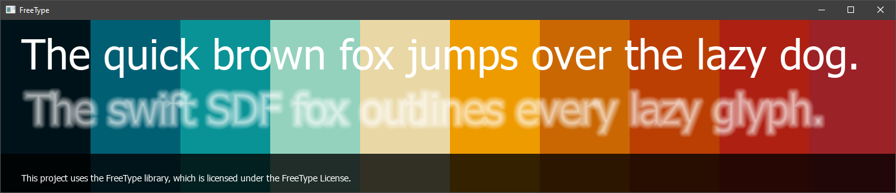

# FreeType.UsageExample
This repository is a demonstration of how to use bindings of [FreeType](https://github.com/kallisto56/FreeType) for [Beef](https://github.com/beefytech/Beef) programming language.

Project is configured to look for library in the `BeefLibs` folder. Project also depends on SDL2, which is shipped with Beef at the moment.



While this project provides fully working example from loading to layout and rendering, I thought that it's important to write a boiled down version of it. So, after loading `FT_Face` we are iterating over a set of characters, retrieving metrics and rendering glyphs. Then packing those glyphs into an atlas and transfering that on GPU side. Below is code to do that (except GPU part) for a single character.

```C#
String fileName = @"C:\\Windows\Fonts\Tahoma.ttf";
FT_Library library = ?;
FT_Face face = ?;
uint8[] image = ?;
float fontSize = 32;

// Initialize library and load new face
FT_Init_FreeType(out library);
FT_New_Face(library, fileName.CStr(), 0, out face);

// Set character size
// FreeType represents font metrics in 1/64th pixel units, that's why we are multiplying font's size.
FT_Set_Char_Size(face, 0, FT_F26Dot6(fontSize * FT_FIXED_POINT_SCALE), 0, 72);

// Get glyph index and load it
var glyphIndex = FT_Get_Char_Index(face, FT_ULong('A'));
FT_Load_Char(face, glyphIndex, .FT_LOAD_DEFAULT);

FT_GlyphSlot slot = face.glyph;

// This rasterizes a glyph into FT_GlyphSlot
FT_Render_Glyph(slot, .FT_RENDER_MODE_NORMAL);

// Extract metrics
var advanceWidth = slot.advance.x >> 6;
var advanceHeight = slot.advance.y >> 6;
var offestLeft = slot.bitmap_left;
var offsetTop = slot.bitmap_top;
var pixelCoords = int[4] (0, 0, slot.bitmap.width, slot.bitmap.rows);
int width = slot.bitmap.width;
int height = slot.bitmap.rows;

// Creating storage for the bitmap
image = scope uint8[width * height * 1];

// Blitting
Internal.MemCpy(image.CArray(), slot.bitmap.buffer, image.Count);

// The only thing we left to extract is kerning, but that requires second character
var anotherGlyphIndex = FT_Get_Char_Index(face, FT_ULong('B'));
FT_Get_Kerning(face, glyphIndex, anotherGlyphIndex, .FT_KERNING_DEFAULT, var kerningAB);

// Once we're done with the face, we can free it
FT_Done_Face(face);

// And this is how to free instance of the library
FT_Done_FreeType(library);
```


## License

This project is licensed under the MIT License. See the [LICENSE](LICENSE) file for details.

### FreeType License

This project uses the FreeType library, which is licensed under the FreeType License. For more information, see the [FreeType License](https://www.freetype.org/license.html)